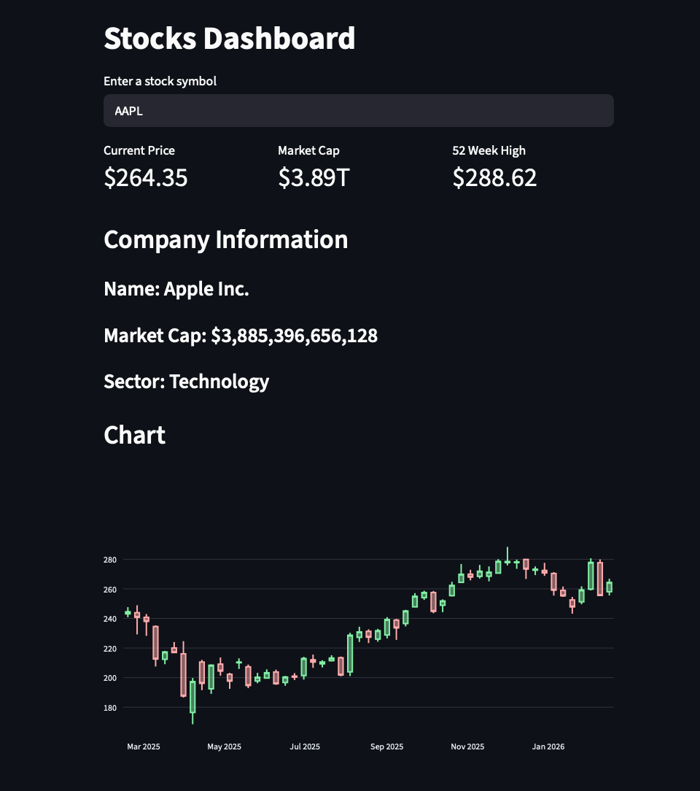

# Stock Market Analytics Dashboard

An interactive financial dashboard built with **Python, Streamlit, and Yahoo Finance data**.

## Dashboard Preview


This project allows users to explore stock performance, financial metrics, and company fundamentals through an interactive interface.

## Features

• Interactive stock ticker input  
• Live financial data from Yahoo Finance  
• Key financial metrics (price, market cap, 52-week high)  
• Company information display  
• Candlestick stock price chart  
• Quarterly / Annual financial toggle  
• Revenue and net income visualizations  

## Technologies Used

- Python
- Streamlit
- Altair
- yfinance
- Plotly
- Pandas
- Watchdog

## How to Run the Project

Install dependencies:

```
pip install -r requirements.txt
```

Run the dashboard:
```
streamlit run stocks_dashboard.py
```

The dashboard will launch locally in your browser.
